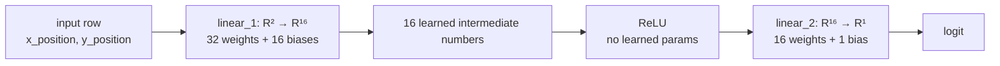

# Week 05 — Hidden Layer Lab Notes

## Goal

Compare a linear classifier with a one-hidden-layer neural network on the same nonlinear moon-shaped dataset.

## Dataset findings

We used `make_moons` with:

- `n_samples=500`
- `noise=0.25`
- `random_state=42`

The generated table has shape `(500, 3)`:

- `x_position`
- `y_position`
- `class_label`

## Train/test split findings

The dataset was split into:

- 400 training rows
- 100 test rows

`X_train` has shape `(400, 2)` because each row has two input features.

`y_train` has shape `(400,)` before tensor conversion because each row has one class label.

## Tensor findings

The tensors have shapes:

- `X_train_tensor`: `[400, 2]`
- `y_train_tensor`: `[400, 1]`
- `X_test_tensor`: `[100, 2]`
- `y_test_tensor`: `[100, 1]`

The labels were reshaped to column tensors so they match the model output shape.

## Logits and sigmoid

The linear model outputs logits.

Sigmoid converts logits into probabilities between `0` and `1`.

Example observed probabilities:

- `0.578782`
- `0.668075`
- `0.418066`
- `0.393962`
- `0.539528`

## Linear classifier findings

The linear model uses:

```text
score = weight_1 * x_position + weight_2 * y_position + bias
```

It has:

- 2 weights
- 1 bias

After continued training, the linear model reached:

- final train loss: `0.3238`
- train accuracy: `0.848`
- test accuracy: `0.820`

The loss kept decreasing slowly, but the model still appears limited.

Current interpretation: this is probably a model-capacity limit because the curved moon pattern cannot be cleanly separated by one straight boundary.

## MLP interpretation

An MLP stands for multilayer perceptron, but the biological language is only a metaphor.

In code, the model is a chain of functions:

```text
logit = linear_2(relu(linear_1(input_point)))
```

The model contains stored weights and biases. Training changes those stored numbers.

## Hidden units

`HIDDEN_UNITS = 16` means the first linear layer creates 16 intermediate output numbers for each input row.

It does not mean there are only 16 weights.

Because each input row has 2 features, each hidden unit needs 2 weights and 1 bias:

```text
hidden_raw_i = weight_ix * x_position + weight_iy * y_position + bias_i
```

So the first layer has:

- `16 * 2 = 32` weights
- `16` biases
- `48` learned numbers total

## ReLU and named parameters

The model structure is:

```text
0: Linear(2 -> 16)
1: ReLU()
2: Linear(16 -> 1)
```

`ReLU` does not appear in `named_parameters()` because it has no learned weights or biases.

It still matters because it changes the function from one big linear recipe into a nonlinear chain that can bend the decision boundary.

## Connection-first diagram



This is the concrete view:

```text
logit = linear_2(relu(linear_1(input_point)))
```

The “neural network” language is shorthand. The actual code is a function chain with trainable connection weights.
